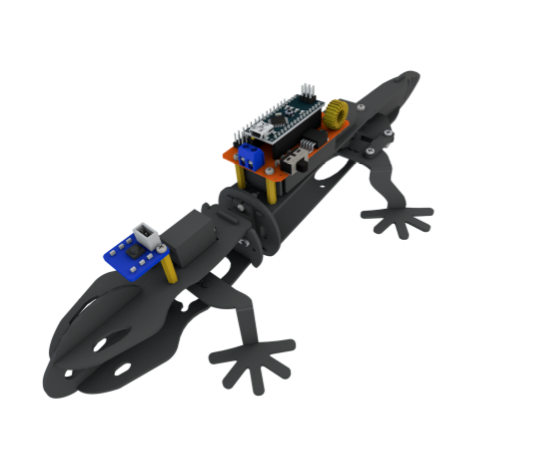

# lizard

## The lizard did not respond after pressing the remote control
1.Use the serial port to print to check if the infrared port is normal

2.Is the wiring of the steering gear reversed?

3.Did you burn the code correctly?