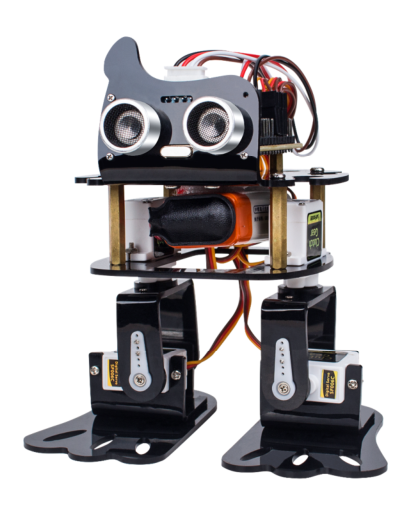

# sloth

## The servo cannot be rotated

Is the connection incorrect? Brown line should be outside

Maybe there is no battery or the power switch on the control board is not energized.

Check whether the wiring position is correct

If there are no problems in the above two steps, please see if the ultrasonic module can be used.

If the ultrasonic module can not be used, it may be a problem with the control panel, please contact customer service.
 
If one servo is not running, other servos are running normally. Connect the normally rotating steering gear to the interface that does not rotate the steering gear, press the RST key and wait for 5 seconds. If the original normal servo is still running, then it is the servo problem and a replacement servo is needed. If the original normal servo does not rotate, then there is something wrong with the control board, and a control board needs to be replaced.