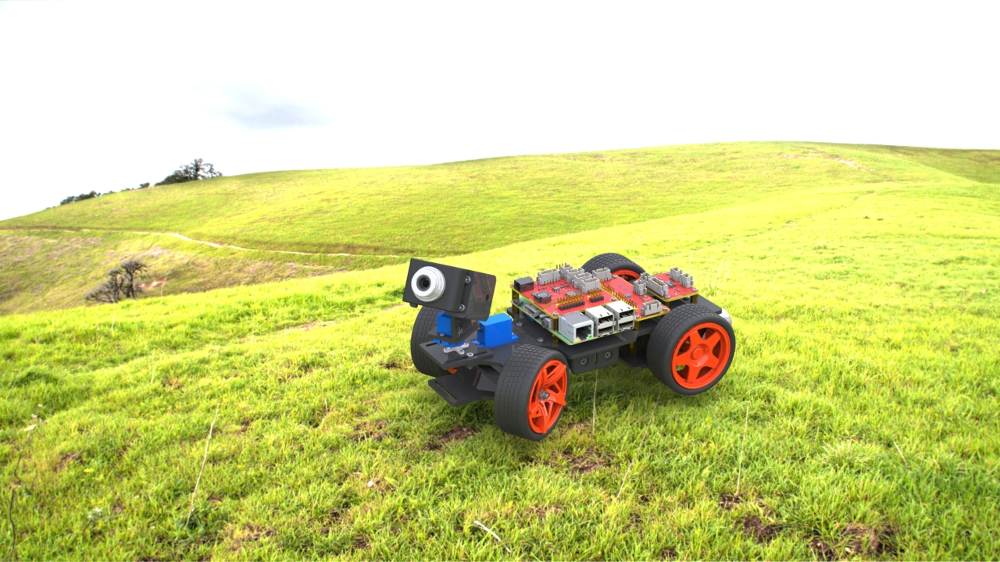

# PiCar-V

## The connection error is because the car and client do not have the correct      network connection, you can try the following:

1. Check if the server side on the Raspberry Pi is open correctly and there is no error message.
2. Confirm that your client and Raspberry Pi are on the same network.

the difference between Smart Video Car Kit V2.0 and Smart Video Car Kit for Raspberry Pi with Android App

## The difference between a generation of video cars and a second generation video car

PiCar-V(Smart Video Car Kit V2.0) is an upgrade version of Smart Video Car Kit, 
with easy wiring, better camera with wide angle lens, a switch and a simple 
battery indicator, better looks and more simple python package for use. 
PiCar-V is extendable, but only with special made sensors, checkout PiCar-S as 
an example. On the other hand, V1.0 is much more free to add on your own 
sensors and modules, if you don't mind the camera, or you don't need a power 
switch, and you would like to add more sensors on it, you should try V1.0. 
PiCar-V also have a simple ball track example, maybe that will give you some 
idea of making a vision project.
