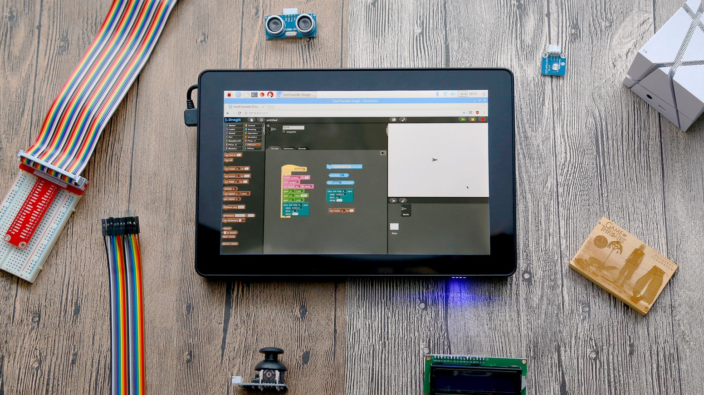

# raspad

## Black screen without backlight

Is there light in the led below?

If it is not lit after pressing the power button without plugging in, but the three green lights are on after the power is connected, please check the battery connection.

If the led light under the power button is on when the power is not connected, please check the screen line

If the led light under the power supply is not turned on, please check whether there is something wrong with the power adapter, which can be detected by a multimeter. The inside of the socket is positive and the outside is negative, and the voltage should be 5v

## Image file, raspberry pie system
Please re-burn Raspberry Pi OS to SD card.

Raspberry Pi image file download address:  

<a href="https://www.raspberrypi.org/downloads/raspbian/">https://www.raspberrypi.org/downloads/raspbian/</a>

You can re-download RasspberryPi OS to TF card.
Add a few more software.

<a href="../../img/raspoberrypi/raspad/Install the Raspberry Pi system.docx">Please refer to the documentation for specific operations.</a>

## Bluetooth keyboard can't connect

Steps to connect a Bluetooth keyboard:
1. open the Bluetooth keyboard switch.

2. Press "Fn" and "C". Blue light flashes.
   
3. Click on the Bluetooth icon of RasPad and select Add Device.
   
4. Wait a moment, click on “Bluetooth keyboard” to pair.
   
5. Input the matching password displayed by RasPad on the Bluetooth keyboard and press “Enter”.
   
6.  the connection is successful.

## Wifi can't connect
The Raspberry Pi comes with WiFi, so no WiFi adapter is required, and the “USB WiFi” in the kit is a USB microphone.
Raspberry Pi 3 B+ needs to set "Country" to connect, please set "Country".

## Raspberry pie system

Raspberry Pi image file download address:   
<a href="https://www.raspberrypi.org/downloads/raspbian/">https://www.raspberrypi.org/downloads/raspbian/</a>

You can re-download RasspberryPi OS to TF card.
Add a few more software.
